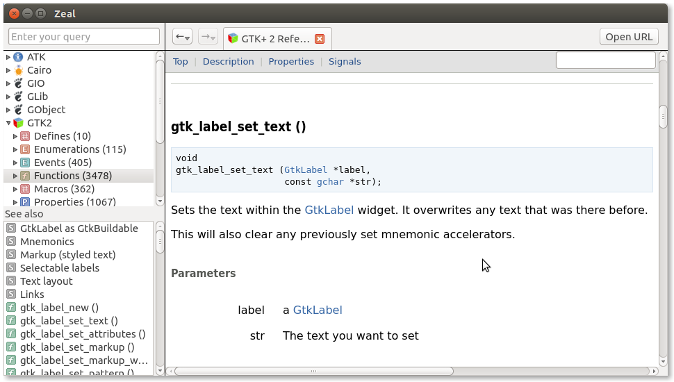

# GTK-Zeal-Docset
[GTK](http://www.gtk.org/) documentation for [Zeal](http://zealdocs.org/)
Tested with Ubuntu 14.04

## Screenshot:


## Depends on:
+ libatk1.0-doc
+ libcairo2-doc
+ libglib2.0-doc
+ libgtk2.0-doc
+ libgtk-3-doc
+ libpango1.0-doc

## Usage:
```
git clone https://github.com/AhmadHamzeei/GTK-Zeal-Docset.git
cd GTK-Zeal-Docset
./autogen.sh
cp -r *.docset ~/.local/share/Zeal/Zeal/docsets
```

